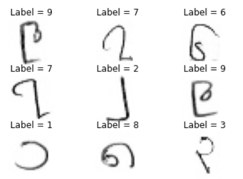
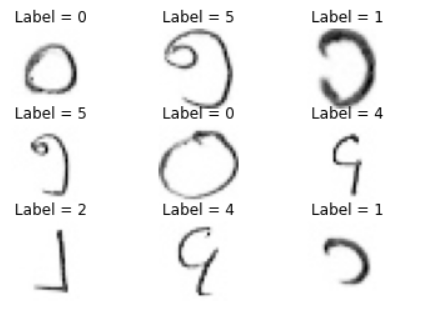

# BHDD-using-streamlit

### Burmese Handwritten Digit Dataset
- Train Images : 60000 with image size (28,28)

- Test Images : 27561 with image size (28,28)

- Classes : 10, i.e, handwritten digits 0 t0 9

>>> pip install -r requirements.txt
>>> streamlit run app.py
