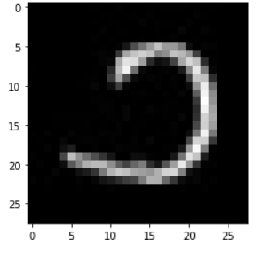

# BHDD using ConvNet

## Update ! 3 Jan, 2021
- Updated model architecture
- The best result - 0.99 F-score of classification is by using ConvNet with Regularization (Dropout). 
- Epochs : 20
- Dropout : 0.2
- GPU Execution

- Model architecture 
```
Model: "sequential"
_________________________________________________________________
 Layer (type)                Output Shape              Param #   
=================================================================
 conv2d (Conv2D)             (None, 26, 26, 32)        320       
                                                                 
 max_pooling2d (MaxPooling2D  (None, 13, 13, 32)       0         
 )                                                               
                                                                 
 conv2d_1 (Conv2D)           (None, 11, 11, 64)        18496     
                                                                 
 max_pooling2d_1 (MaxPooling  (None, 5, 5, 64)         0         
 2D)                                                             
                                                                 
 flatten (Flatten)           (None, 1600)              0         
                                                                 
 dropout (Dropout)           (None, 1600)              0         
                                                                 
 dense (Dense)               (None, 10)                16010     
                                                                 
=================================================================
Total params: 34,826
Trainable params: 34,826
Non-trainable params: 0
```

## Burmese Handwritten Digits Dataset
- Dataset Link : https://github.com/baseresearch/BHDD
- Download data.pkl directly in order to get pkl raw file

- Train Images : 60000 with image size (28,28)


- Test Images : 27561 with image size (28,28)


- Classes : 10, i.e, handwritten digits 0 to 9



## Basic ConvNet architecture

### Abstract
The goal of this project is to create a model that will be able to recognize and determine the handwritten digits from its image by using the concepts of Convolution Neural Network and BHDD dataset. Though the goal is to create a model which can recognize the handwritten digits, it can be extended to letters and an individual’s handwriting. The major goal of the proposed system is understanding Convolutional Neural Network, and applying it to the Burmese handwritten recognition system.

### Problem statement
To make children easier recognize digits by playing Burmese Handwritten Digits Recognizer.

### Install requirements
```{r, engine='bash', count_lines}
tra@thura-pc:~$ pip install -r requirements.txt
```

### Train BHDD with Basic ConvNet Architecture with Dropout
```{r, engine='bash', count_lines}
tra@thura-pc:~$ python cnn_train.py
```
- Learning Curves after training with ConvNet


### Run and deploy using Streamlit 
```{r, engine='bash', count_lines}
tra@thura-pc:~$ streamlit run app.py
```
### Experiments 
- We tried Single-layer Perceptron, Multi-layer Perceptron and ConvNet.
- The best result - 0.98 F-score of classification is by using ConvNet with Regularization (Dropout). Future works still need to be done for architectural innovation on BHDD.
- Epochs : 15
- GPU Execution
- Tools : OpenCV, Matplotlib, Numpy, Keras, Streamlit
- Results


### User Interface Prototype


### Demo 
- Try it yourself on [streamlit](https://share.streamlit.io/thuraaung1601/bhdd-using-streamlit/main/app.py)
- Demo GIF


### Contributors
- Thura Aung
- Khaing Khant Min Paing
- Khant Zwe Naing

### Presentations
- [Project Presentation](https://youtu.be/NFmexZ64Kdo)

### Architecture we used 


### Future Works
- Need to test GANs on BHDD 

### References 
[1] https://github.com/baseresearch/BHDD

[2] A.Dutt, A.Dutt, 2016. Handwritten Digit Recognition Using Deep Learning, International Journal of Advanced Research in Computer Engineering & Technology

[3] Y. LeCun, L. Bottou, Y. Bengio, and P. Haffner. "Gradient-based learning applied to document recognition." Proceedings of the IEEE, 86(11):2278-2324, November 1998.
